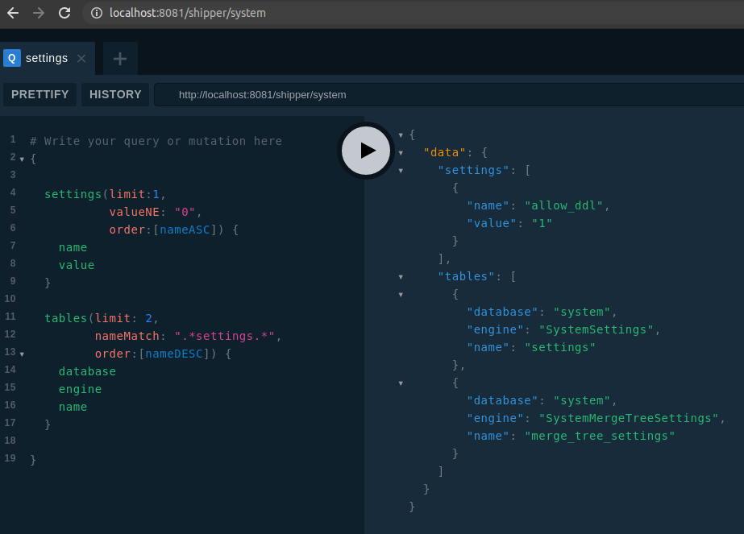

# Shipper

Http service which provides Clickhouse data via GraphQL interface.

It supports conitions, limits and offsets. All requests can be cached and authentificated based on OpenID Connect.

[](https://godoc.org/github.com/click-stream/shipper)
[](https://travis-ci.org/click-stream/shipper)

## Features

- Support all selectable object: tables, views, materialized views, etc.
- Provide sorting (asc, desc), record limits and offsets 
- Support conditions like: Match, EQ, NE, LT, LE, GT, GE 
- Include GraphQL Playground, OIDC, Prometheus metrics
- Refresh schemas automatically
- Provide response cache using size or time  

## Build

```sh
git clone https://github.com/click-stream/shipper.git
cd shipper/
go build
```

## Example

```sh
./shipper --http-listen ":8081" --graphql-mode Playground \
          --clickhouse-host=HOST --clickhouse-password=PASSWORD --clickhouse-debug \
          --clickhouse-database-pattern "system" --clickhouse-table-pattern "(settings|tables)" \
          --log-template "{{.msg}}" --log-format stdout
```

## GraphQL to Clickhouse

GraphQL request:
```graphql
{
  settings(limit:1,
           valueNE: "0",
           order:[nameASC]) {
    name
    value
  }
  
  tables(limit: 2,
         nameMatch: ".*settings.*",
         order:[nameDESC]) {
    database
    engine
    name
  }
}
```
GraphQL response:
```graphql
{
  "data": {
    "settings": [
      {
        "name": "allow_ddl",
        "value": "1"
      }
    ],
    "tables": [
      {
        "database": "system",
        "engine": "SystemSettings",
        "name": "settings"
      },
      {
        "database": "system",
        "engine": "SystemMergeTreeSettings",
        "name": "merge_tree_settings"
      }
    ]
  }
}
```




Clickhouse queries based on GraphQL request:

```sql
SELECT `name`, `value` FROM `system`.`settings` WHERE `value` != '0' ORDER BY `name` ASC LIMIT 1 OFFSET 0;
SELECT `database`, `engine`, `name` FROM `system`.`tables` WHERE match(`name`,'.*settings.*') = 1 ORDER BY `name` DESC LIMIT 2 OFFSET 0;
```

## Usage

```
Shipper command

Usage:
  shipper [flags]
  shipper [command]

Available Commands:
  help        Help about any command
  version     Print the version number

Flags:
      --clickhouse-cache-clean-seconds int   Clickhouse cache clean seconds
      --clickhouse-cache-life-seconds int    Clickhouse cache life seconds
      --clickhouse-cache-max-size int        Clickhouse cache max size in MB
      --clickhouse-database-pattern string   Clickhouse database pattern (default ".*")
      --clickhouse-debug                     Clickhouse debug
      --clickhouse-host string               Clickhouse host
      --clickhouse-ident-format string       Clickhouse ident format (default "`%s`")
      --clickhouse-password string           Clickhouse password
      --clickhouse-port int                  Clickhouse port (default 9000)
      --clickhouse-query-limit int           Clickhouse query limit (default 1000)
      --clickhouse-read-timeout int          Clickhouse read timeout (default 10)
      --clickhouse-refresh-interval int      Clickhouse refresh interval in seconds (default 60)
      --clickhouse-table-pattern string      Clickhouse table pattern (default ".*")
      --clickhouse-url-pattern string        Clickhouse url pattern (default "/{database}")
      --clickhouse-user string               Clickhouse user (default "default")
      --graphql-mode string                  Graphql mode: GraphiQL, Playground
      --graphql-pretty                       Graphql pretty response format
  -h, --help                                 help for shipper
      --http-cert string                     Http cert file or content
      --http-chain string                    Http CA chain file or content
      --http-external-host string            Http external host
      --http-key string                      Http key file or content
      --http-listen string                   Http listen (default ":80")
      --http-oidc-callback-url string        Http oidc callback url (default "/callback")
      --http-oidc-client-id string           Http oidc client id
      --http-oidc-client-secret string       Http oidc client secret
      --http-oidc-config-url string          Http oidc config url
      --http-oidc-default-url string         Http oidc default url
      --http-oidc-enabled                    Http oidc enabled
      --http-oidc-login-url string           Http oidc login url (default "/login")
      --http-oidc-logout-url string          Http oidc logout url (default "/logout")
      --http-oidc-scopes-url string          Http oidc scopes (default "profile, email, roles, groups")
      --http-tls                             Http TLS
      --http-url string                      Http url (default "/shipper")
      --log-format string                    Log format: json, text, stdout (default "text")
      --log-level string                     Log level: info, warn, error, debug, panic (default "info")
      --log-template string                  Log template (default "{{.func}} [{{.line}}]: {{.msg}}")
      --prometheus-listen string             Prometheus listen (default "127.0.0.1:8080")
      --prometheus-url string                Prometheus endpoint url (default "/metrics")
```

## Environment variables

For containerization purpose all command switches have environment variables analogs.

- SHIPPER_LOG_FORMAT
- SHIPPER_LOG_LEVEL
- SHIPPER_LOG_TEMPLATE

- SHIPPER_PROMETHEUS_URL
- SHIPPER_PROMETHEUS_LISTEN

- SHIPPER_HTTP_URL
- SHIPPER_HTTP_LISTEN
- SHIPPER_HTTP_TLS
- SHIPPER_HTTP_CERT
- SHIPPER_HTTP_KEY
- SHIPPER_HTTP_CHAIN
- SHIPPER_HTTP_EXTERNAL_HOST
- SHIPPER_HTTP_OIDC_ENABLED
- SHIPPER_HTTP_OIDC_CLIENT_ID
- SHIPPER_HTTP_OIDC_CLIENT_SECRET
- SHIPPER_HTTP_OIDC_CONFIG_URL
- SHIPPER_HTTP_OIDC_LOGIN_URL
- SHIPPER_HTTP_OIDC_LOGOUT_URL
- SHIPPER_HTTP_OIDC_CALLBACK_URL
- SHIPPER_HTTP_OIDC_DEFAULT_URL
- SHIPPER_HTTP_OIDC_SCOPES

- SHIPPER_GRAPHQL_PRETTY
- SHIPPER_GRAPHQL_MODE

- SHIPPER_CLICKHOUSE_HOST
- SHIPPER_CLICKHOUSE_PORT
- SHIPPER_CLICKHOUSE_USER
- SHIPPER_CLICKHOUSE_PASSWORD
- SHIPPER_CLICKHOUSE_DEBUG
- SHIPPER_CLICKHOUSE_URL_PATTERN
- SHIPPER_CLICKHOUSE_READ_TIMEOUT
- SHIPPER_CLICKHOUSE_DATABASE_PATTERN
- SHIPPER_CLICKHOUSE_TABLE_PATTERN
- SHIPPER_CLICKHOUSE_QUERY_LIMIT
- SHIPPER_CLICKHOUSE_IDENT_FORMAT
- SHIPPER_CLICKHOUSE_CACHE_LIFE_SECONDS
- SHIPPER_CLICKHOUSE_CACHE_CLEAN_SECONDS
- SHIPPER_CLICKHOUSE_CACHE_MAX_SIZE
- SHIPPER_CLICKHOUSE_REFRESH_INTERVAL
